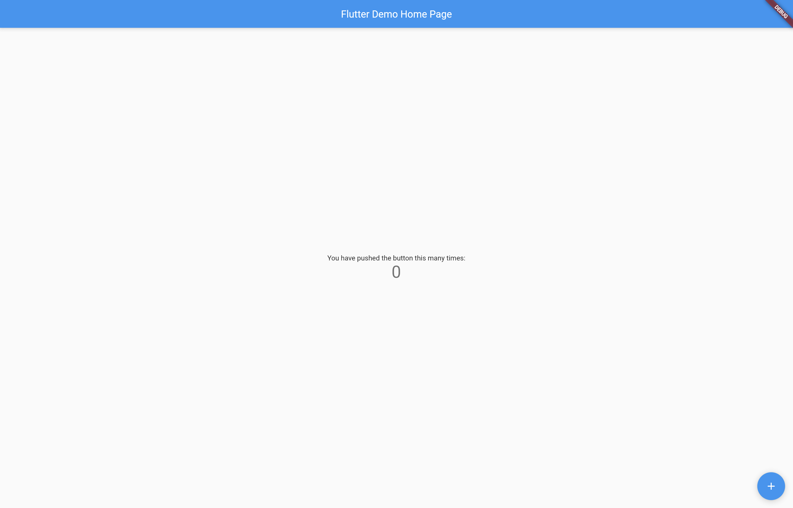

# screenshot_integration_demo

Flutter screenshot integration testing (supported on Android & Web).

> [27-July-2021] Tested on **master** branch of Flutter.

## Usage

1. Make sure you are on the latest **master** branch of Flutter.

2. Download Chrome drive from [here](https://chromedriver.chromium.org/downloads).

3. Run `chromedriver`:
   
   ```sh
   ./chromedriver --port=4444
   ```

4. Run the test on web using:
   
   ```sh
   flutter drive \
    --driver=test_driver/integration_test.dart \
    --target=integration_test/screenshot_test.dart \
    -d web-server
   ```

5. It should generate the screenshot in the root directory.

Sample screenshot running on web:



## Test system

Flutter doctor result:

```sh
[✓] Flutter (Channel master, 2.4.0-5.0.pre.203, on macOS 11.2.3 20D91
    darwin-arm, locale en-IN)
    • Flutter version 2.4.0-5.0.pre.203 at
      /Users/souvikbiswas/fvm/versions/master
    • Upstream repository https://github.com/flutter/flutter.git
    • Framework revision 738ce43d97 (24 minutes ago), 2021-07-26 23:40:49 -0700
    • Engine revision 717d55cdd4
    • Dart version 2.14.0 (build 2.14.0-354.0.dev)

[✓] Android toolchain - develop for Android devices (Android SDK version 30.0.3)
    • Android SDK at /Users/souvikbiswas/Library/Android/sdk
    • Platform android-30, build-tools 30.0.3
    • Java binary at: /Applications/Android
      Studio.app/Contents/jre/jdk/Contents/Home/bin/java
    • Java version OpenJDK Runtime Environment (build
      1.8.0_242-release-1644-b3-6915495)
    • All Android licenses accepted.

[✓] Xcode - develop for iOS and macOS
    • Xcode at /Applications/Xcode.app/Contents/Developer
    • Xcode 12.5.1, Build version 12E507
    • CocoaPods version 1.10.1

[✓] Chrome - develop for the web
    • Chrome at /Applications/Google Chrome.app/Contents/MacOS/Google Chrome

[✓] Android Studio (version 4.1)
    • Android Studio at /Applications/Android Studio.app/Contents
    • Flutter plugin can be installed from:
      🔨 https://plugins.jetbrains.com/plugin/9212-flutter
    • Dart plugin can be installed from:
      🔨 https://plugins.jetbrains.com/plugin/6351-dart
    • Java version OpenJDK Runtime Environment (build
      1.8.0_242-release-1644-b3-6915495)

[✓] VS Code (version 1.58.2)
    • VS Code at /Applications/Visual Studio Code.app/Contents
    • Flutter extension version 3.24.0

[✓] Connected device (2 available)
    • macOS (desktop) • macos  • darwin-arm64   • macOS 11.2.3 20D91 darwin-arm
    • Chrome (web)    • chrome • web-javascript • Google Chrome 92.0.4515.107

• No issues found!
```


